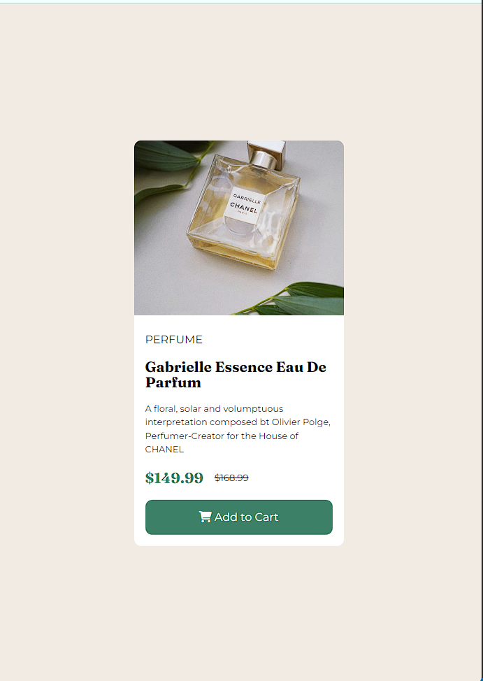

# Frontend Mentor - Product preview card component solution

This is a solution to the [Product preview card component challenge on Frontend Mentor](https://www.frontendmentor.io/challenges/product-preview-card-component-GO7UmttRfa). Frontend Mentor challenges help you improve your coding skills by building realistic projects. 

## Table of contents

- [Overview](#overview)
  - [The challenge](#the-challenge)
  - [Screenshot](#screenshot)
  - [Links](#links)
- [My process](#my-process)
  - [Built with](#built-with)
  - [What I learned](#what-i-learned)
  - [Continued development](#continued-development)
  - [Useful resources](#useful-resources)
- [Author](#author)
- [Acknowledgments](#acknowledgments)

## Overview

  My first FEM challenge. Mixed feelings because it brought the reality that I still have a long way to go in this journey. To be sincere this challenge looked pretty simple till I started and being the first I would take I was almost giving up. It's not the best or definitely good enough. So if by chance you come across this it would be helpful and nice to get feedback mostly on the positioning and calculations. I had a lot of problems with widths and height which also led to it being half-responsive

### The challenge

Users should be able to:

- View the optimal layout depending on their device's screen size
- See hover and focus states for interactive elements

### Screenshot

### Links

- Solution URL: [Add solution URL here](https://github.com/sharonolat/FEM-Product-Preview-Card-Challenge.git)
- Live Site URL: [Add live site URL here](https://your-live-site-url.com)

## My process
- Created the html markup
- Created utility classes. May not have been completely necessary but tyring to get accustomed to the best practices.
- Created the base styles. Simple css reset and the like
- Proceeded to complete challenge

### Built with

- Semantic HTML5 markup
- CSS custom properties
- Flexbox
- Sass

### What I learned
- First I learned using absolute positioning and transform: translate to center the div 
-Second I learnt about obect-fit and aspect-ratio properties for the first time. Not totally gotten a hang of it but hopefully I do soon
-Third I experienced the image overlaying the border-radius and learning using oerflow: hidden is a simple fix(I believe this brought up responsiveness problems as I'm not so good yet)

### Continued development

- Positioning
- Object-fit property
-Aspect-ratio property
- Responsiveness
-Scaling: Height and Widths

### Useful resources

- [Resource 1](https://blog.hubspot.com/website/center-div-css) - This helped with getting to center the div. I really liked this pattern and will use it going forward.

## Author

- Frontend Mentor - [@yourusername](https://www.frontendmentor.io/profile/sharonolat)
- Twitter - [@sharonolat](https://www.twitter.com/sharonolat)

## Acknowledgments

I would like to thank Grace Brown and Alex Marshall for shedding light on few concepts

